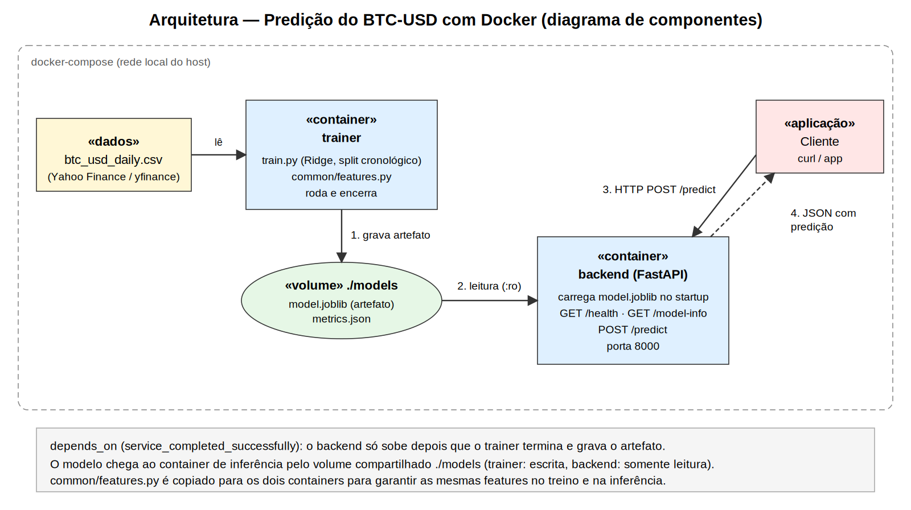
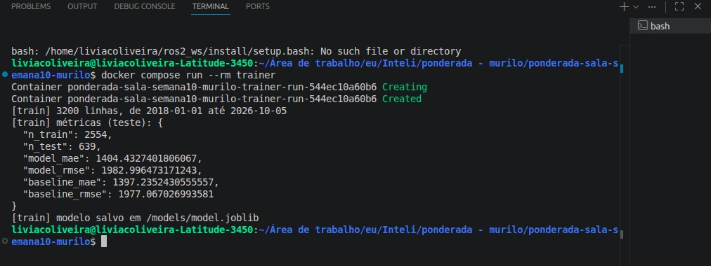
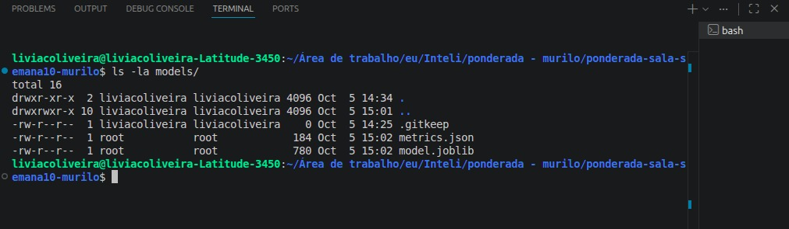
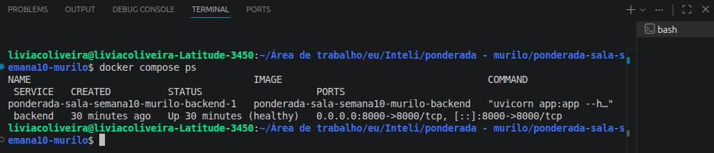
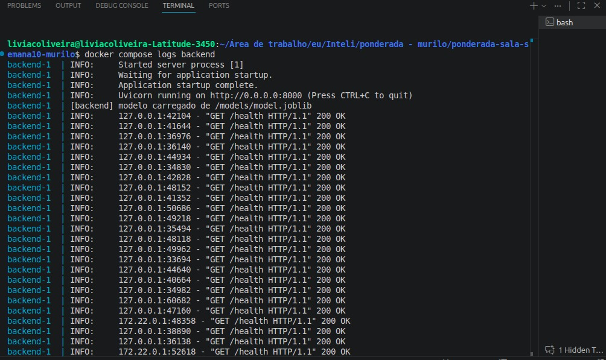
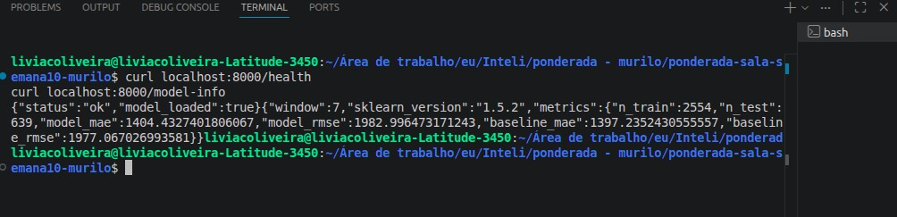
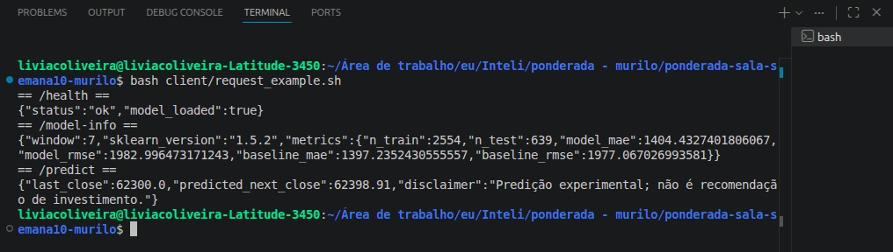
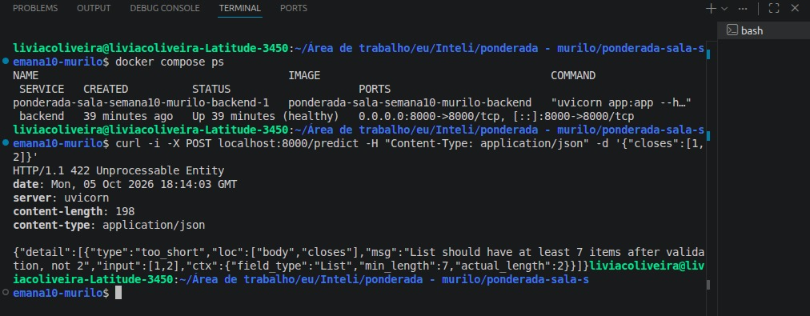

# DEVLOG: Atividade Ponderada M7

Esse arquivo tem como objetivo descrever e explicar as tomadas de decisão realizadas durante o desenvolvimento dessa atividade ponderada feitas por mim.

## Arquitetura da solução (UML)

Antes de escrever qualquer código, entendi que o primeiro passo deveria ser desenhar a arquitetura para ter clareza de quais componentes existiriam e como os dados e o modelo circulariam entre eles. O diagrama abaixo,feito pela IA com as minhas instruções, é um diagrama de componentes e representa o fluxo completo da solução.



Ao descrever para a Inteligência Artificial como fazer esse diagrama, identifiquei o ponto de partida como sendo o arquivo `btc_usd_daily.csv`, com o histórico diário de preços do BTC-USD obtido do Yahoo Finance. Esse arquivo é lido pelo container `trainer`, que roda o script `train.py`, treina o modelo e termina a execução. O resultado do treino é o artefato `model.joblib`, junto com um `metrics.json`, gravados em um volume Docker compartilhado montado em `./models`.

Esse volume é a resposta para a pergunta de como o modelo treinado chega ao container de inferência: o `trainer` escreve nele e o container `backend` o monta em modo somente leitura, carregando o `model.joblib` quando inicia. Para garantir a ordem, configurei no `docker-compose.yml` que o backend só sobe depois que o trainer terminou com sucesso. 

O backend é uma API em FastAPI com três rotas, `/health`, `/model-info` e `/predict`, exposta na porta 8000. Por fim, o cliente (uma requisição `curl` ou qualquer aplicação) envia um POST para `/predict` com os últimos preços e recebe um JSON com a predição do fechamento do dia seguinte.

## Como usei IA neste trabalho

Usei o Claude (Anthropic) como ferramenta de apoio durante a atividade e quero registrar onde isso aconteceu. Ele me ajudou a organizar o trabalho em fases seguindo a divisão de tempo do enunciado e a definir a estrutura de pastas do repositório. Ele também gerou a primeira versão do código de treino (`training/train.py`) e da lógica de features (`common/features.py`), incluindo a proposta de usar razões de preço em vez de preços absolutos e de usar o Ridge como modelo, além da primeira versão do backend (`backend/app.py`), dos Dockerfiles, do `docker-compose.yml`, e do diagrama UML.

O meu papel foi decidir o escopo a partir do enunciado, executar tudo no meu ambiente, testar cada componente, conferir os resultados, tirar as evidências e escrever esse devlog com o que realmente observei. Vou explicar melhor nas próximas seções passo a passo.

## Resumo da solução

A solução tem duas etapas bem separadas. Na primeira, o container `trainer` prepara os dados, treina um modelo que estima o fechamento do dia seguinte do BTC-USD e salva o artefato no volume compartilhado. Na segunda, o container `backend` carrega esse artefato e responde predições por HTTP. Separei o treino do backend para que o serviço de inferência ficasse leve e fácil de testar, e para deixar explícito como o modelo é entregue de um componente ao outro.

## Justificativas detalhadas

Antes de implementar qualquer código, eu tive que responder algumas perguntas que orientaram todo o projeto. A primeira foi: por que Bitcoin e por que um horizonte de um dia? A resposta foi simples: o problema pede uma moeda digital e um horizonte de predição bem definido, e o fechamento do dia seguinte é um alvo fácil de interpretar, fácil de avaliar e suficiente para a atividade. Essa escolha reduziu a complexidade sem perder o foco principal, que era demonstrar a arquitetura do pipeline de ML em containers.

A segunda decisão foi a fonte dos dados. Eu escolhi o Yahoo Finance por meio da biblioteca `yfinance` porque ele oferece acesso direto ao histórico diário do Bitcoin sem exigir chave de API. Isso era mais prático e mais rápido do que buscar dados em outra fonte ou depender de um arquivo externo que eu não controlasse. Como o enunciado também pede reprodutibilidade, eu deixei a lógica de baixar o CSV automaticamente se ele não existir, e também mantive esse CSV em `data/` para permitir o uso local e a execução em outros ambientes.

A terceira decisão foi sobre a forma de representar as features. Em vez de usar o preço absoluto em si, eu usei razões entre preços dentro de uma janela de 7 dias. A justificativa foi que o valor do Bitcoin muda muito ao longo do tempo, e usar valores absolutos como entrada faria com que o modelo aprendesse muito mais a escala do ativo do que o padrão de movimento. Ao transformar os preços em proporções, eu consegui criar uma representação mais estável e mais adequada para um modelo linear. Esse foi um ponto importante porque ele mostra que a escolha de features foi pensada para o dado e não foi aleatória.

A quarta decisão foi sobre o modelo. Eu escolhi o Ridge porque ele é simples, rápido, interpretável e serializável em um artefato `.joblib`. A atividade não exigia um modelo financeiro sofisticado nem um sistema que tentasse “adivinhar” o mercado, ela somente exigia demonstrar corretamente o fluxo completo de treinamento e inferência. O Ridge foi uma escolha natural porque ele se encaixa no escopo da atividade e porque ele também permite uma comparação honesta com o baseline do último valor.

A quinta decisão foi sobre a arquitetura do projeto. Eu separei treinamento e inferência em containers diferentes porque isso deixa o processo mais fiel à lógica do problema e mais fácil de explicar. O `trainer` produz o artefato, e o `backend` consome esse artefato. Essa separação também deixa claro o papel de cada componente e reduz o risco de dependência desnecessária entre os serviços. O volume compartilhado `./models` foi a solução mais simples para entregar o artefato, e o `depends_on` do `docker-compose.yml` foi usado para garantir a ordem correta das etapas.

A sexta decisão foi sobre a API. Eu escolhi FastAPI porque ele combina Python, validação automática e documentação de endpoints sem complicar a implementação. Isso foi importante porque a atividade evalua a funcionalidade real do servidor e a facilidade de testar a aplicação. Em vez de criar uma API improvisada, eu optei por uma estrutura simples, previsível e clara, com endpoints para saúde, métricas e predição.

Em resumo, eu não escolhi essas decisões por exigência técnica isolada, eu as escolhi porque cada uma delas faz sentido para o problema específico da atividade. A ideia foi equilibrar simplicidade, reprodutibilidade e clareza, sem deixar de demonstrar que o sistema funciona de ponta a ponta.

## Fase 0: Planejamento

Comecei lendo o enunciado e identificando o que ele cobra: treino em container ou notebook, artefato salvo, um segundo container com backend em Python que carregue o modelo, UML, devlog e uma demonstração de predição. Como a precisão do modelo não é um critério para perder nota, decidi priorizar a integração entre as partes e a possibilidade de reproduzir tudo.

Segui a recomendação do próprio enunciado para fechar o escopo: moeda BTC-USD, dados diários de fechamento, horizonte de um dia e separação cronológica entre treino e teste. Escolhi o `yfinance` como fonte porque não exige chave de API e gera um CSV que fica salvo no projeto, o que facilitou bastante o processo.

## Fase 1: Dados, features e modelo

O ponto mais importante foi decidir como representar os dados. O preço do Bitcoin mudou muito de escala desde 2018, então usar o valor absoluto como entrada distorceria a relação que o modelo tenta aprender. Por isso as features são razões entre preços dentro de uma janela de 7 dias, ou seja, o preço de cada dia anterior dividido pelo preço do dia atual. O alvo é a razão entre o fechamento do dia seguinte e o do dia atual, e a predição final é o último fechamento multiplicado pela razão prevista.

O modelo escolhido foi o Ridge, uma regressão linear regularizada. Ele é simples, rápido, fácil de explicar e se salva bem em formato `.joblib`, o que combina com o objetivo da atividade de demonstrar a integração. Também comparei o resultado com um baseline de "amanhã = hoje", porque em séries financeiras um modelo pode parecer bom sem superar a simples repetição do último valor. A separação entre treino e teste é cronológica, com os 80% mais antigos para treinar e os 20% mais recentes para testar, sem embaralhar as linhas.

## Fase 2: Treinamento e exportação do artefato

O treino está em `training/train.py`. O script carrega o CSV, ou o baixa pelo `yfinance` se ele não existir, ordena por data, monta as janelas de 7 dias, gera as features, separa treino e teste, treina o Ridge, calcula as métricas e salva o `model.joblib` e o `metrics.json` na pasta `models`. Executei o treino com:

```bash
docker compose build trainer
docker compose run --rm trainer
```

O dataset ficou com 3200 linhas, de 2018-01-01 até 2026-10-05, resultando em 2554 janelas de treino e 639 de teste. No conjunto de teste, o modelo teve MAE de 1404,43 e RMSE de 1982,99, enquanto o baseline teve MAE de 1397,24 e RMSE de 1977,07. Ou seja, o modelo ficou praticamente igual ao baseline, até um pouco pior. Isso é coerente com a natureza do problema: o preço diário de uma criptomoeda se comporta quase como um passeio aleatório, e os últimos 7 preços carregam pouca informação útil sobre o dia seguinte. 

A primeira evidência é a saída do treinamento no terminal, onde aparecem a quantidade de linhas, o período dos dados, as métricas e a mensagem de que o modelo foi salvo.



A segunda evidência mostra o conteúdo da pasta `models` depois do treino, com o `model.joblib` e o `metrics.json`, comprovando que o artefato foi de fato gerado e ficou disponível no volume compartilhado.



## Fase 3: Backend de inferência

O backend está em `backend/app.py`. Ao iniciar, ele carrega o `model.joblib` do volume e expõe três rotas. A rota `GET /health` informa se o serviço está ativo e se o modelo foi carregado, `GET /model-info` devolve o tamanho da janela, a versão do scikit-learn e as métricas do treino, e `POST /predict` recebe uma lista com pelo menos 7 fechamentos e devolve o próximo fechamento estimado. A rota de predição rejeita listas com menos de 7 valores e preços que não sejam positivos.

Duas decisões evitaram problemas entre os containers. A primeira foi manter a lógica de features em um módulo único, `common/features.py`, copiado para os dois containers, para que treino e inferência usem exatamente a mesma transformação. A segunda foi fixar as mesmas versões de numpy, scikit-learn e joblib nos dois arquivos `requirements.txt`, já que um modelo salvo com `joblib` depende da versão da biblioteca que o criou. Subi os serviços com:

```bash
docker compose up --build -d
docker compose ps
docker compose logs backend
```

A terceira evidência é a saída de `docker compose ps`, que mostra o container do backend em execução e a porta 8000 publicada.



A quarta evidência são os logs do backend, onde aparece a mensagem de que o modelo foi carregado a partir de `/models/model.joblib`. Esse log é o que prova que o artefato produzido no treino foi mesmo entregue e lido pelo container de inferência.



## Fase 4 — Testes do fluxo completo

Com os dois containers funcionando, testei a comunicação com o backend usando `curl`. Primeiro verifiquei se o serviço estava ativo e consultei as informações do modelo:

```bash
curl localhost:8000/health
curl localhost:8000/model-info
```

O `/health` retornou `{"status":"ok","model_loaded":true}`, confirmando que o serviço está no ar e com o modelo carregado. O `/model-info` retornou a janela de 7 dias, a versão 1.5.2 do scikit-learn e as mesmas métricas do treino, o que mostra que o backend está usando o modelo certo. O print abaixo reúne as duas chamadas.



Depois testei a predição com o script de cliente, que envia 7 fechamentos de exemplo:

```bash
bash client/request_example.sh
```

A resposta trouxe o último fechamento enviado, 62300.0, e a predição para o dia seguinte, 62398.91, junto com um aviso de que a predição é experimental. Os 7 preços desse teste são valores de exemplo, usados apenas para demonstrar que uma solicitação chega ao backend e retorna uma predição; eles não representam o mercado real. Esta é a demonstração principal da atividade.



Por fim, testei o comportamento do backend com uma entrada inválida, enviando apenas dois preços, quando o mínimo é sete:

```bash
curl -i -X POST localhost:8000/predict -H "Content-Type: application/json" -d '{"closes":[1,2]}'
```

O backend respondeu com o status HTTP 422 e uma mensagem de erro indicando que a lista precisa ter ao menos 7 itens, em vez de tentar calcular uma predição com dados insuficientes. Esse teste mostra que a validação funciona e que a API se protege de entradas incorretas de maneira geral.



## Dificuldades

A maior dificuldade conceitual foi entender que, nesse tipo de problema, o objetivo não é necessariamente obter uma previsão financeiramente "boa" no sentido de vencer o mercado, e sim demonstrar corretamente o fluxo completo de um sistema de ML em produção. O BTC é um ativo muito volátil e o preço diário tem comportamento bastante ruidoso, então o modelo linear simples acabou ficando muito próximo do baseline de "amanhã = hoje". Em vez de interpretar isso como falha, eu entendi que esse resultado faz sentido para uma série temporal tão instável e para um problema em que a informação disponível é limitada a preços históricos. Essa foi uma revisão importante da minha expectativa inicial: a solução precisava ser correta e bem justificada, não necessariamente mais sofisticada.

Outra dificuldade importante foi pensar na estrutura do problema sem quebrar o princípio da validação temporal. Em séries temporais, o erro mais comum é misturar treino e teste de uma forma que cria vazamento de informação e faz o modelo parecer melhor do que é. Para resolver isso, eu defini que o split fosse cronológico, sem embaralhamento, e que as features fossem construídas a partir de janelas temporais. Isso foi um ajuste conceitual fundamental, porque o modelo não podia ser validado como se fosse um problema supervisionado clássico de classificação ou regressão tabular.

Também houve uma dificuldade prática e conceitual na definição da arquitetura: eu precisava separar treinamento e inferência de forma que o artefato do modelo fosse entregue ao backend sem duplicar lógica. A solução foi usar um volume compartilhado em Docker e manter uma única fonte de geração de features para os dois ambientes. Isso foi importante porque, se eu tivesse duplicado a lógica em treino e em inferência, o sistema ficaria mais frágil e o risco de inconsistência seria grande. Em resumo, o maior aprendizado não foi apenas "fazer o código funcionar", mas entender que a arquitetura, a escolha do modelo e a forma de validar o problema precisam seguir a lógica do negócio e do dado, e não apenas a conveniência de implementação.

## Limitações conhecidas

O modelo usa apenas o preço histórico dos últimos 7 dias, sem outras informações de mercado, e não supera o baseline de "amanhã = hoje". A solução também não tem retreino automático, autenticação nem monitoramento, e a validação foi feita em um único split temporal, o que é suficiente para a atividade mas não é a avaliação mais completa para um problema financeiro. 

## Conclusão

O fluxo pedido na atividade funciona de ponta a ponta: o treino gera o artefato, ele chega ao container de inferência pelo volume compartilhado, o backend o carrega e responde predições por HTTP, tudo reproduzível com `docker compose up --build`. O desempenho do modelo é fraco, mas isso era esperado para esse tipo de problema e não era o foco da atividade. 
